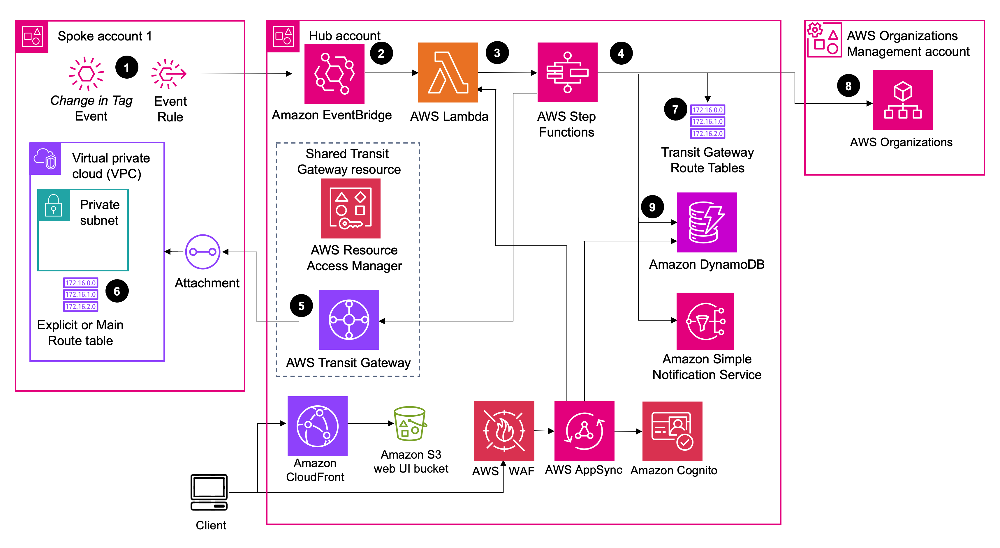

# Network Orchestration for AWS Transit Gateway
## Formerly known as: Serverless Transit Network Orchestrator (STNO)

[🚀Solution Landing Page](https://aws.amazon.com/solutions/implementations/network-orchestration-aws-transit-gateway)
| [🚧Feature request](https://github.com/aws-solutions/serverless-transit-network-orchestrator/issues/new?assignees=&labels=feature-request%2C+enhancement&template=feature_request.md&title=)| [🐛Bug Report](https://github.com/aws-solutions/serverless-transit-network-orchestrator/issues/new?assignees=&labels=bug%2C+triage&template=bug_report.md&title=)
| [📜Documentation Improvement](https://github.com/aws-solutions/serverless-transit-network-orchestrator/issues/new?assignees=&labels=document-update&template=documentation_improvements.md&title=)


_Note: For relevant information outside the scope of this readme, refer to the [solution landing page](https://aws.amazon.com/solutions/implementations/network-orchestration-aws-transit-gateway) and
[implementation guide](https://docs.aws.amazon.com/solutions/latest/network-orchestration-aws-transit-gateway/solution-overview.html).

## Table of contents

- [Solution overview](#solution-overview)
- [Architecture](#architecture)
- [Installation](#installing-pre-packaged-solution-template)
- [Customization](#customization)
  - [Setup](#setup)
  - [Unit test](#unit-test)
  - [Build](#build)
  - [Deploy](#deploy)
- [File structure](#file-structure)
- [License](#license)
- [Operational metrics](#collection-of-operational-metrics)

## Solution overview

The Network Orchestration for AWS Transit Gateway solution adds automation to AWS Transit Gateway. This solution 
provides the tools necessary to automate the process of setting up and managing transit networks in multi-account and multi-Region AWS 
environments. The solution deploys a web interface to help you control, audit, and approve transit network changes. This solution supports both AWS Organizations and standalone AWS account types.

This Network Orchestration for AWS Transit Gateway version supports Transit Gateway inter-Region peering and Amazon Virtual Private Cloud (Amazon VPC) prefix lists. Customers can establish peering connections between transit gateways to extend connectivity and build global networks spanning multiple AWS Regions. You can also automatically register Transit Gateway with Network Manager. This helps customers visualize and monitor their global network from a single dashboard rather than toggling between Regions from the AWS Management Console.

## Architecture

The solution follows hub-spoke deployment model and uses given workflow:

1. An Amazon EventBridge rule monitors specific VPC and subnet tag changes. 
2.	An EventBridge rule in the spoke account sends the tags to the EventBridge bus in the hub account. 
3.	The rules associated with the EventBridge bus invoke an AWS Lambda function to start the solution workflow. 
4.	AWS Step Functions (solution state machine) processes network requests from the spoke accounts. 
5.	The state machine workflow attaches a VPC to the transit gateway.
6.	The state machine workflow updates the VPC route table associated with the tagged subnet.
7.	The state machine workflow updates the transit gateway route table with association and propagation changes. 
8.	(Optional) The state machine workflow updates the attachment name with the VPC name and the Organizational Unit (OU) name for the spoke account (retrieved from the Org Management account). 
9.	The solution updates Amazon DynamoDB with the information extracted from the event and resources created, updated, or deleted in the workflow.



## Installing pre-packaged solution template

- Deploy in the account you want to act as the hub: [network-orchestration-hub.template](https://solutions-reference.s3.amazonaws.com/serverless-transit-network-orchestrator/latest/network-orchestration-hub.template)
- Deploy in spoke accounts: [network-orchestration-spoke.template](https://solutions-reference.s3.amazonaws.com/serverless-transit-network-orchestrator/latest/network-orchestration-spoke.template)
- Deploy in AWS Organizations management account: [network-orchestration-organization-role.template](https://solutions-reference.s3.amazonaws.com/serverless-transit-network-orchestrator/latest/network-orchestration-organization-role.template)

_Note: All templates need to be deployed in the same preferred Region._

***
## Customization

Use the following steps if you want to customize the solution or extend the solution with newer capabilities.

### Setup

- Python Prerequisite: python=3.11 | pip3=23.2.1
- Javascript Prerequisite: node=v18.16.0 | npm=9.5.1

Clone the repository and make desired code changes.

```
git clone aws-solutions/network-orchestration-for-aws-transit-gateway
```

_Note: The following steps have been tested under the preceding pre-requisites._

### Unit Test

Run unit tests to ensure that your added customization passes the tests.

```
cd ./source
chmod +x ./run-unit-tests.sh
./run-unit-tests.sh
cd ..
```

_✅ Ensure that all unit tests pass. Review the generated coverage report._

### Build

Use the following steps to build your customized distributable.

_Note: For PROFILE_NAME, substitute the name of an AWS CLI profile that contains appropriate credentials for deploying in your preferred Region._

- Create an Amazon Simple Storage Service (Amazon S3) bucket with the format 'MY-BUCKET-<aws_region>'. The solution's CloudFormation template will expect the source code to be located in this bucket. <aws_region> is where you are testing the customized solution.

You can use the following commands to create this bucket:

```
ACCOUNT_ID=$(aws sts get-caller-identity --output text --query Account --profile <PROFILE_NAME>)
REGION=$(aws configure get region --profile <PROFILE_NAME>)
BUCKET_NAME=stno-$ACCOUNT_ID-$REGION
aws s3 mb s3://$BUCKET_NAME/

# Default encryption:
aws s3api put-bucket-encryption \
  --bucket $BUCKET_NAME \
  --server-side-encryption-configuration '{"Rules": [{"ApplyServerSideEncryptionByDefault": {"SSEAlgorithm": "AES256"}}]}'

# Enable public access block:
aws s3api put-public-access-block \
  --bucket $BUCKET_NAME \
  --public-access-block-configuration "BlockPublicAcls=true,IgnorePublicAcls=true,BlockPublicPolicy=true,RestrictPublicBuckets=true"
```

- Configure the solution name, version number, and bucket name:

```
SOLUTION_NAME=network-orchestration-for-aws-transit-gateway
DIST_OUTPUT_BUCKET=stno-$ACCOUNT_ID
VERSION=custom001
```

- Build the distributable using build-s3-dist.sh:

```
cd ./deployment
chmod +x ./build-s3-dist.sh
./build-s3-dist.sh $DIST_OUTPUT_BUCKET $SOLUTION_NAME $VERSION
```

_✅ All assets are now built. You should see templates under deployment/global-s3-assets and other artifacts (console and lambda binaries) under deployment/regional-s3-assets._

### Deploy

Deploy the distributable to an S3 bucket in your account:

```
aws s3 ls s3://$BUCKET_NAME  # should not give an error
cd ./deployment
aws s3 cp global-s3-assets/ s3://$BUCKET_NAME/$SOLUTION_NAME/$VERSION/ --recursive --expected-bucket-owner $ACCOUNT_ID --profile <PROFILE_NAME>
aws s3 cp regional-s3-assets/ s3://$BUCKET_NAME/$SOLUTION_NAME/$VERSION/ --recursive --expected-bucket-owner $ACCOUNT_ID --profile <PROFILE_NAME>
```
_✅ All assets are now staged on your S3 bucket. You or any user can use S3 links for deployments._

## File structure

Network Orchestration for AWS Transit Gateway solution consists of:

- Solution templates to provision needed AWS resources
- Lambda microservices to implement solution functional logics
  - custom_resource: Handle cfn custom resource CRUD
  - state_machine: Handle solution's core state machine
  - tgw_peering: Handle solution transit gateway peering functionality
- UI to deploy solution UI components

<pre>
|-.github
|-architecture.png                                     [ architecture diagram ]
|-deployment/    
  |-manifest-generator                                        [ generates manifest files for solution ui ]
  |-network-orchestration-hub.template                        [ hub template ]
  |-network-orchestration-hub-service-linked-roles.template   [ hub template, deploys service linked roles]
  |-network-orchestration-spoke.template                      [ spoke template]  
  |-network-orchestration-spoke-service-linked-roles.template [ spoke template, deploys only service linked roles ]  
  |-network-orchestration-organization-role.template          [ role template, deploys in management account ]
  |-build-s3-dist.sh                                          [ script to build solution microservices ]
|-source/
  |-cognito-trigger                   [ manage new user creation in the cognito user pool ]
  |-lambda/                           [ solution microservices ]
    |-custom_resource                 [ CloudFormation Custom Resources ]
    |-tgw_peering_attachment          [ Manage Transit Gateway Peering Attachments]
    |-tgw_vpc_attachment              [ Manage VPC to Transit Gateway Attachments ]
  |-ui                                [ solution ui components ] 
  |-run-unit-test.sh                  [ script to run unit tests ]
|-additional_files                    [ CODE_OF_CONDUCT, NOTICE, LICENSE, sonar-project.properties etc.]
</pre>

## License

See license [here](./LICENSE.txt).

## Anonymized data collection

This solution includes an option to send anonymized operational metrics to AWS. We use this data to better understand how customers use this solution and related services and products. For more information, including how to disable this capability, please see the [implementation guide](https://docs.aws.amazon.com/solutions/latest/serverless-transit-network-orchestrator/anonymized-data-collection.html).

---

Copyright Amazon.com, Inc. or its affiliates. All Rights Reserved.

Licensed under the Apache License Version 2.0 (the "License"). You may not use this file except in compliance with the License. A copy of the License is located at:

    http://www.apache.org/licenses/LICENSE-2.0

or in the ["license"](./LICENSE.txt) file accompanying this file. This file is distributed on an "AS IS" BASIS, WITHOUT WARRANTIES OR CONDITIONS OF ANY KIND, express or implied. See the License for the specific language governing permissions and limitations under the License.
